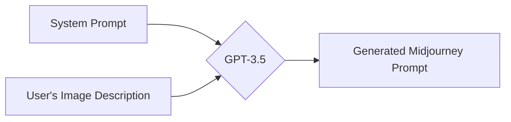
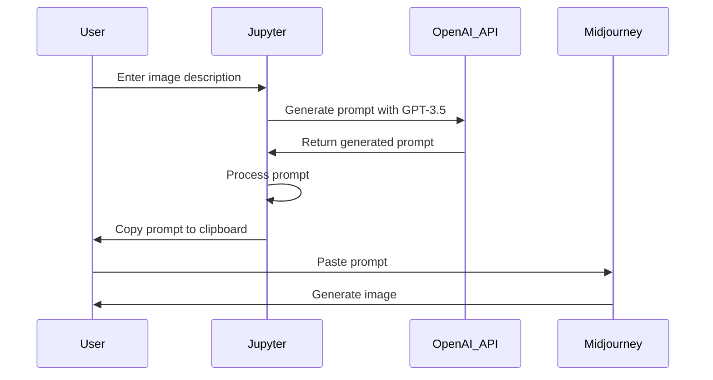

# Midjourney Image Prompt Generator

This Jupyter notebook helps you generate image-generation prompts for the Midjourney AI image generation service. It uses OpenAI's GPT-3.5-turbo to generate the prompts based on your input description of the desired image.

This project includes a `system_prompt.txt` file that the notebook reads, and then uses in the starting message for a ChatGPT session.  The prompt engineering is all in that file, and you can adjust that to tweak your default Midjourney parameters.



The process for generating a Midjourney prompt and image using the Jupyter notebook can be described in the following steps:

The user enters an image description into the Jupyter notebook interface.
The Jupyter notebook sends the image description to the OpenAI API, which generates a prompt using the GPT-3.5 model.
The generated prompt is processed by the Jupyter notebook to ensure its validity and to act as a safeguard against potential hallucinations.
The Jupyter notebook copies the processed prompt to the user's clipboard automatically.
The user pastes the generated prompt into the Midjourney platform.
Midjourney processes the prompt and generates the corresponding image for the user.



## Prerequisites

To use this notebook, you'll need:

1. An OpenAI API key. You can sign up for one [here](https://beta.openai.com/signup/).
2. Python 3.x installed on your system.
3. Jupyter notebook installed on your system.

## Dependencies

This notebook requires a few Python libraries.  The first cell of the notebook
will attempt to install and load the libraries.

## Setup

1. Clone this repository to your local machine:
```bash
git clone https://github.com/your_username/midjourney-image-prompt-generator.git
```
2. Save your OpenAI API key in a file named `openai_api_key.txt` in the same folder as the Jupyter notebook.
3. If you want to modify the system prompt used by GPT-3.5-turbo, edit the `system_prompt.txt` file.

## Usage

1. Open the Jupyter notebook:
```bash
jupyter notebook midjourney_image_prompt_generator.ipynb
```
2. Run ALL the cells in the notebook in order.  You must run the cells at the end to define functions before you can generate prompts.
3. In the interactive UI, enter a description of the image you want to generate in the text input field.
4. Click the "Generate" button. The generated prompt will be displayed and automatically copied to your clipboard.
5. Use the generated prompt with the Midjourney AI image generation service.

## License

This project is licensed under the MIT License. See the LICENSE file for details.

