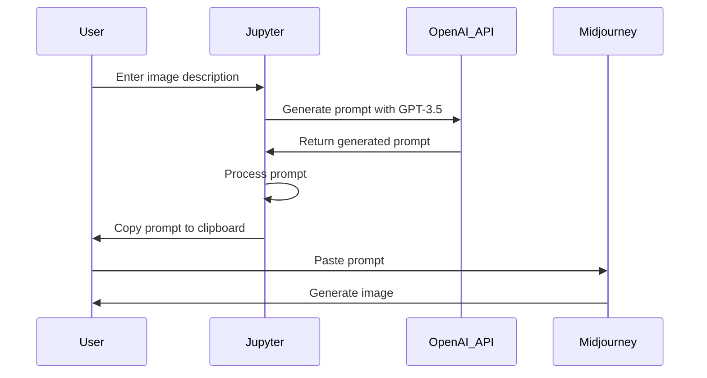

# Midjourney Image Prompt Generator

This Jupyter notebook helps you generate image-generation prompts for the Midjourney AI image generation service. It uses OpenAI's GPT-3.5-turbo to generate the prompts based on your input description of the desired image.''

The overall process for using this with Midjourney is:

 1. User enters image description into Jupyter notebook.
 2. Jupyter notebook uses OpenAI API to generate a prompt from GPT-3.5.
 3. Jupyter notebook processes the generated prompt as a safeguard against hallucinations.
 4. Jupyter notebook copies the generated and processed prompt to the user's clipboard.
 5. User pastes generated prompt into Midjourney.
 6. Midjourney generates image for user.



## Prerequisites

To use this notebook, you'll need:

1. An OpenAI API key. You can sign up for one [here](https://beta.openai.com/signup/).
2. Python 3.x installed on your system.
3. Jupyter notebook installed on your system.

## Dependencies

This notebook requires the following Python libraries:

- `openai`
- `textwrap`
- `ipywidgets`
- `pyperclip`

You can install these packages using pip:

```bash
pip install openai ipywidgets pyperclip
```

## Setup

1. Clone this repository to your local machine:
```bash
git clone https://github.com/your_username/midjourney-image-prompt-generator.git
```

2. Save your OpenAI API key in a file named openai_api_key.txt in the same folder as the Jupyter notebook.
3. If you want to modify the system prompt used by GPT-3.5-turbo, edit the system_prompt.txt file.

## Usage

1. Open the Jupyter notebook:
```bash
jupyter notebook midjourney_image_prompt_generator.ipynb
```
2. Run the cells in the notebook in order.
3. In the interactive UI, enter a description of the image you want to generate in the text input field.
4. Click the "Generate" button. The generated prompt will be displayed and automatically copied to your clipboard.
5. Use the generated prompt with the Midjourney AI image generation service.

## License

This project is licensed under the MIT License. See the LICENSE file for details.

