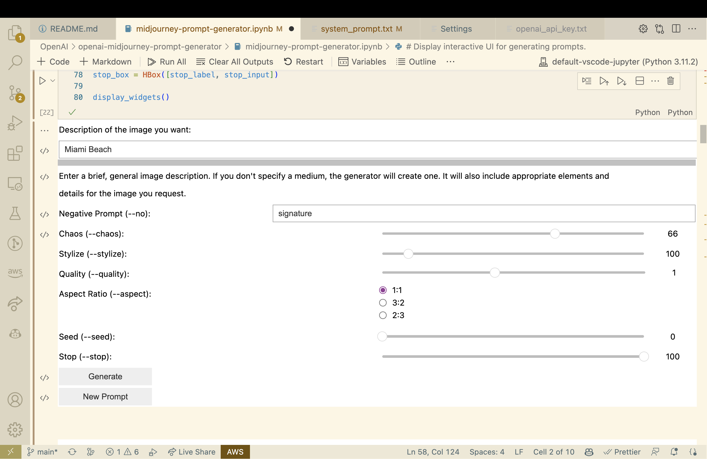
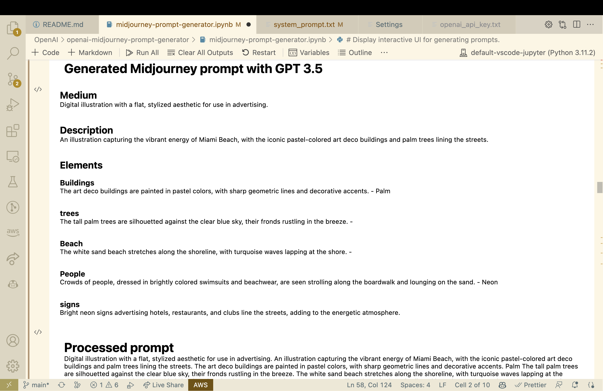
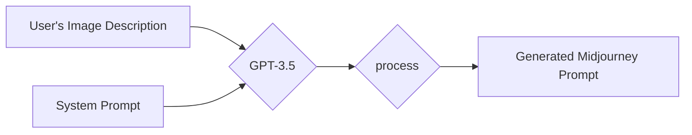
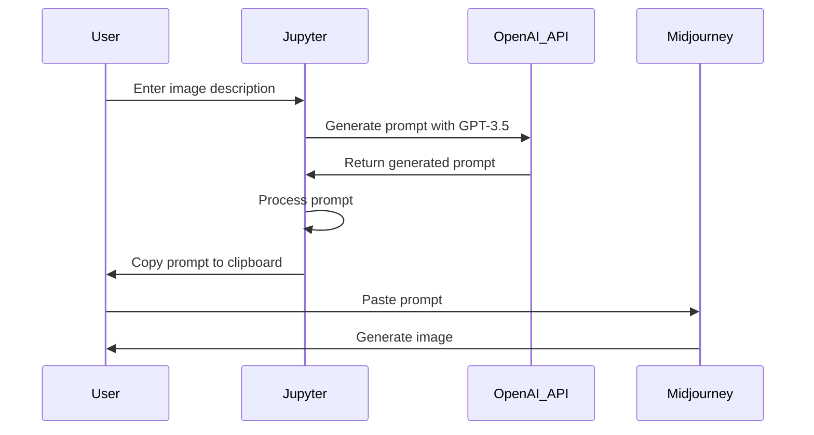

# Midjourney Image Prompt Generator

This Jupyter notebook helps you generate image-generation prompts for the Midjourney AI image generation service. It uses OpenAI's GPT-3.5-turbo to generate the prompts based on your input description of the desired image.  Many thanks to GPT4 and GitHub Copilot for writing nearly 100% of the code in this project.  And, most of this README.  Including the diagrams.

# Example

In this example, I want to use Midjourney to generate an image of "Miami Beach."
But that's vague, and Midjourney works a lot better if you give it specifics.  And
so, I'm using GPT 3.5 to imagine a specific image of Miami Beach, and to describe the elements in that image.



After pressing the "generate" button, GPT 3.5 imagines a medium for an image like I'm describing.  If I tell it that I want a picture of a person smiling, then it isn't going to select "landscape photograph" for the medium, since that wouldn't make sense.  It imagines a lot of detail for the medium, so if it's a photograph then it will specify the camera, film and lens.  If it's a painting then it will describe what kind and what techniques and what color palette.

It will also add more detail into the description of the image that you give it.  It will try to add details that make sense for what you requested.

Then, it will imagine a list of elements for the image.  If it's a street photograph of a person then it might select elements like hair style, clothing, and facial expression.  If it's a landscape painting then it might select elements like foreground, weather conditions, and time of day.



The notebook then uses unit-tested code to parse that response and extract the elements, and then recombine it into a single line of text.  It uses unit-tested Python functions to generate a parameter list, given your UI settings, and append that to the prompt:

> Digital illustration with a flat, stylized aesthetic for use in advertising. An illustration capturing the vibrant energy of Miami Beach, with the iconic pastel-colored art deco buildings and palm trees lining the streets. The art deco buildings are painted in pastel colors, with sharp geometric lines and decorative accents. Palm The tall palm trees are silhouetted against the clear blue sky, their fronds rustling in the breeze. The white sand beach stretches along the shoreline, with turquoise waves lapping at the shore. Crowds of people, dressed in brightly colored swimsuits and beachwear, are seen strolling along the boardwalk and lounging on the sand. Neon Bright neon signs advertising hotels, restaurants, and clubs line the streets, adding to the energetic atmosphere. --chaos 66 --no signature --seed 0

# Mechanism

The overall idea is to use OpenAI for what it's good at: Imagining appropriate details.  And to use Python for what it's good at: Deterministically assembling prompts, given imagined details.

This project includes a `system_prompt.txt` file that the notebook reads, and then uses in the starting message for a ChatGPT session.  The prompt engineering is all in that file, and you can adjust that to tweak your default Midjourney parameters.



The overall process of generating an image with this tool and OpenAI and Midjourney looks like this:

1. The user enters an image description into the Jupyter notebook interface.
2. The Jupyter notebook sends the image description to the OpenAI API, which generates a prompt using the GPT-3.5 model.
3. The generated prompt is processed by the Jupyter notebook to assemble the elements and parameters into a valid prompt.
4. The Jupyter notebook copies the processed prompt to the user's clipboard automatically.
5. The user pastes the generated prompt into the Midjourney platform.
6. Midjourney processes the prompt and generates the corresponding image for the user.



## Prompt engineering

The system prompt instructs GPT 3.5 to start the prompt with a full sentence,
in proper English, that starts with the medium and then describes the image.
It specifes that we want details like camera type and lens and film type
if it's a photograph, and the type of painting if it's an oil painting.

Then it tells the LLM to imagine a list of about five elements of a photo
like that.  So, if it's a portrait of a person then the elements might be
pose, clothing, hair, etc.  If you asked for a picture of a mountain range
then the elements might be foreground, weather conditions, time of day, etc.

It then tells the model to write a full sentence for each element, imagining
specific details for that element.  The specific details need to be
appropriate for the image requested by the user.

Those are the basic elements that we need for building a prompt.  But, we don't want to use an LLM for doing something like that.  It's better to use deterministic code that we can cover with unit tests to keep it stable and reliable.

## Prompt processing

The raw prompt returned by the OpenAI API will look like this:

> Medium: Digital illustration with a flat, stylized aesthetic for use in advertising. Description: An illustration capturing the vibrant energy of Miami Beach, with the iconic pastel-colored art deco buildings and palm trees lining the streets. Elements: Buildings: The art deco buildings are painted in pastel colors, with sharp geometric lines and decorative accents. Palm trees: The tall palm trees are silhouetted against the clear blue sky, their fronds rustling in the breeze. Beach: The white sand beach stretches along the shoreline, with turquoise waves lapping at the shore. People: Crowds of people, dressed in brightly colored swimsuits and beachwear, are seen strolling along the boardwalk and lounging on the sand. Neon signs: Bright neon signs advertising hotels, restaurants, and clubs line the streets, adding to the energetic atmosphere.

The notebook will parse that into a hash and then combine the values into a paragraph.  Then, it will generate a parameters string based on the settings in the UI widgets.  And finally, it will concatenate the prompt and the parameters string.

## Prerequisites

To use this notebook, you'll need:

1. An OpenAI API key. You can sign up for one [here](https://beta.openai.com/signup/).
2. Python 3.x installed on your system.
3. Jupyter notebook installed on your system.

## Dependencies

This notebook requires a few Python libraries.  The first cell of the notebook
will attempt to install and load the libraries.

## Setup

1. Clone this repository to your local machine.
2. Save your OpenAI API key in a file named `openai_api_key.txt` in the same folder as the Jupyter notebook.
3. If you want to modify the system prompt used by GPT-3.5-turbo, edit the `system_prompt.txt` file.''

## Usage

1. Open the Jupyter notebook:
```bash
jupyter notebook midjourney_image_prompt_generator.ipynb
```
2. Run ALL the cells in the notebook in order.  You must run the cells at the end to define functions before you can generate prompts.
3. In the interactive UI, enter a description of the image you want to generate in the text input field.
4. Click the "Generate" button. The generated prompt will be displayed and automatically copied to your clipboard.
5. Use the generated prompt with the Midjourney AI image generation service.

## License

This project is licensed under the MIT License. See the LICENSE file for details.

