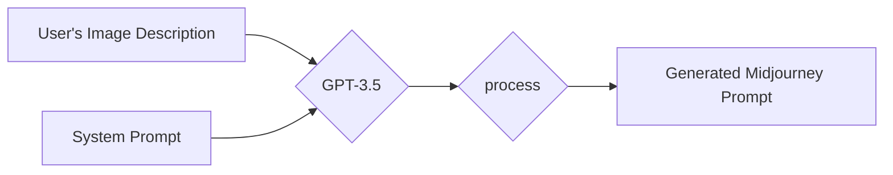
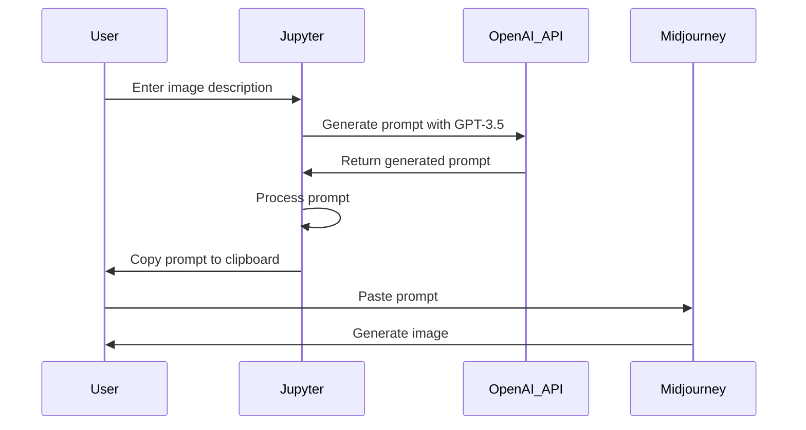

# Midjourney Image Prompt Generator

This Jupyter notebook helps you generate image-generation prompts for the Midjourney AI image generation service. It uses OpenAI's GPT-3.5-turbo to generate the prompts based on your input description of the desired image.  Many thanks to GPT4 and GitHub Copilot for writing nearly 100% of the code in this project.  And, most of this README.  Including the diagrams.

This project includes a `system_prompt.txt` file that the notebook reads, and then uses in the starting message for a ChatGPT session.  The prompt engineering is all in that file, and you can adjust that to tweak your default Midjourney parameters.



The process for generating a Midjourney prompt and image using the Jupyter notebook can be described in the following steps:

1. The user enters an image description into the Jupyter notebook interface.
2. The Jupyter notebook sends the image description to the OpenAI API, which generates a prompt using the GPT-3.5 model.
3. The generated prompt is processed by the Jupyter notebook to ensure its validity and to act as a safeguard against potential hallucinations.
4. The Jupyter notebook copies the processed prompt to the user's clipboard automatically.
5. The user pastes the generated prompt into the Midjourney platform.
6. Midjourney processes the prompt and generates the corresponding image for the user.



## Prompt engineering

The system prompt instructs GPT 3.5 to start the prompt with a full sentence,
in proper English, that starts with the medium and then describes the image.
It specifes that we want details like camera type and lens and film type
if it's a photograph, and the type of painting if it's an oil painting.

Then it tells the LLM to imagine a list of about five elements of a photo
like that.  So, if it's a portrait of a person then the elements might be
pose, clothing, hair, etc.  If you asked for a picture of a mountain range
then the elements might be foreground, weather conditions, time of day, etc.

It tells the model to write a full sentence for each element, imagining
specific details for that element.  The specific details need to be
appropriate for the image requested by the user.

Then, the model completes the prompt by adding a set of Midjourney parameters
I personally like `--chaos 66" by default, and so it always includes that.
I don't like signatures on the bottoms of my images that look like paintings,
so I asked to always add `--no signature`.  I'm trying to teach it to
generate appropriate aspect ratio parameters.

## Prompt processing

The LLM will sometimes generate prompts that won't work in Midjourney.  This
notebook processes the output from the LLM to try to safeguard against some
of the more common problems.

One is that the model will sometimes delimit the individual elements with
`-`, like `...all the way to the sea.  -The waves ware angled...`  The
processing step will remove the `-` and make it `...sea. The waves...`

LLMs will also sometimes hallucinate parameters that Midjourney doesn't
support, despite my best attempts in the system prmpot to tell it not to
do that.  It will sometimes add parameters that don't exist in Midjourney,
like `--aperture 0.5 --focal-length 55mm -Z -D0`.  The notebook includes
a unit-tested function for removing stuff like that from prompts, written
by GPT4.

## Prerequisites

To use this notebook, you'll need:

1. An OpenAI API key. You can sign up for one [here](https://beta.openai.com/signup/).
2. Python 3.x installed on your system.
3. Jupyter notebook installed on your system.

## Dependencies

This notebook requires a few Python libraries.  The first cell of the notebook
will attempt to install and load the libraries.

## Setup

1. Clone this repository to your local machine:
```bash
git clone https://github.com/your_username/midjourney-image-prompt-generator.git
```
2. Save your OpenAI API key in a file named `openai_api_key.txt` in the same folder as the Jupyter notebook.
3. If you want to modify the system prompt used by GPT-3.5-turbo, edit the `system_prompt.txt` file.

## Usage

1. Open the Jupyter notebook:
```bash
jupyter notebook midjourney_image_prompt_generator.ipynb
```
2. Run ALL the cells in the notebook in order.  You must run the cells at the end to define functions before you can generate prompts.
3. In the interactive UI, enter a description of the image you want to generate in the text input field.
4. Click the "Generate" button. The generated prompt will be displayed and automatically copied to your clipboard.
5. Use the generated prompt with the Midjourney AI image generation service.

## License

This project is licensed under the MIT License. See the LICENSE file for details.

